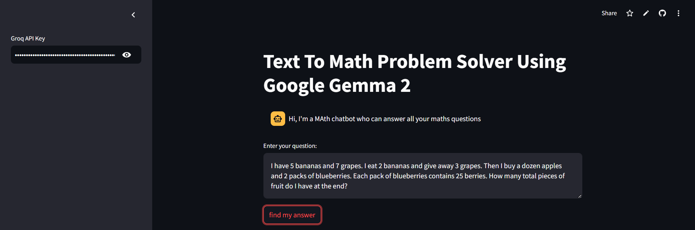
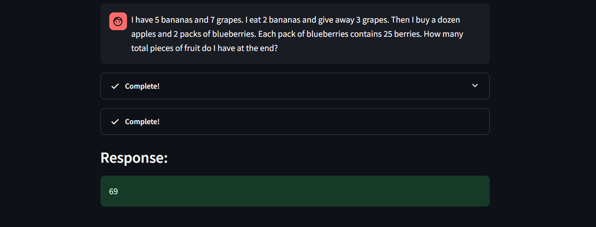

# Text to Math Problem Solver using LLM

## Table of Content

- [Project Summary](#project-summary)
- [Project User Interface](#project-user-interface)
- [Technologies Used](#technologies-used)
- [Implementation Steps](#implementation-steps)

## Project Summary

Developed a Text-to-Math Problem Solver and Data Search Assistant leveraging Groq's Gemma2-9b-It LLM model for natural language processing. The application uses Streamlit for creating an interactive web interface, allowing users to input math-related questions and receive detailed, step-by-step solutions. Key functionalities include:

- Mathematical Problem Solving: Utilizes LLMMathChain for answering math questions, providing both answers and logical explanations.

- Wikipedia Data Retrieval: Integrates Wikipedia API for retrieving external information to answer general knowledge questions, making the assistant versatile for multiple question types.

- Reasoning Capabilities: Incorporates a Reasoning Tool to solve logic-based queries with structured responses.

- Custom Prompting and Agents: Combines LLMChain with custom prompt templates and integrates multiple tools via Zero-Shot React Agent to dynamically handle different types of queries.

The system provides an intuitive chat interface where users can interact with the assistant, input questions, and receive responses with detailed reasoning. The project showcases the power of integrating language models, external data sources, and reasoning tools for a comprehensive, interactive AI solution.

---

## Project User Interface

---

## Technologies Used

- **Python**
- **Streamlit**
- **Groq (Gemma2-9b-It LLM Model)**
- **LangChain**

---

## Implementation Steps

- Create a Groq API key from Groq Cloud platform.
- Copy and Paste the API key in the Sidebar Input field.
- Ask any maths question and enjoy!

